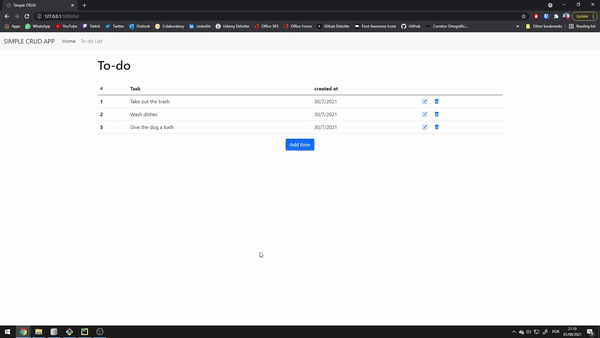

# CRUD-FLASK
A simple fullstack CRUD application coded using pythons flask web framework, SQLAlchemy, SQLite, jinja2 templating language and bootstrap 5. 

This app allowes you to create a simple to-do list.

